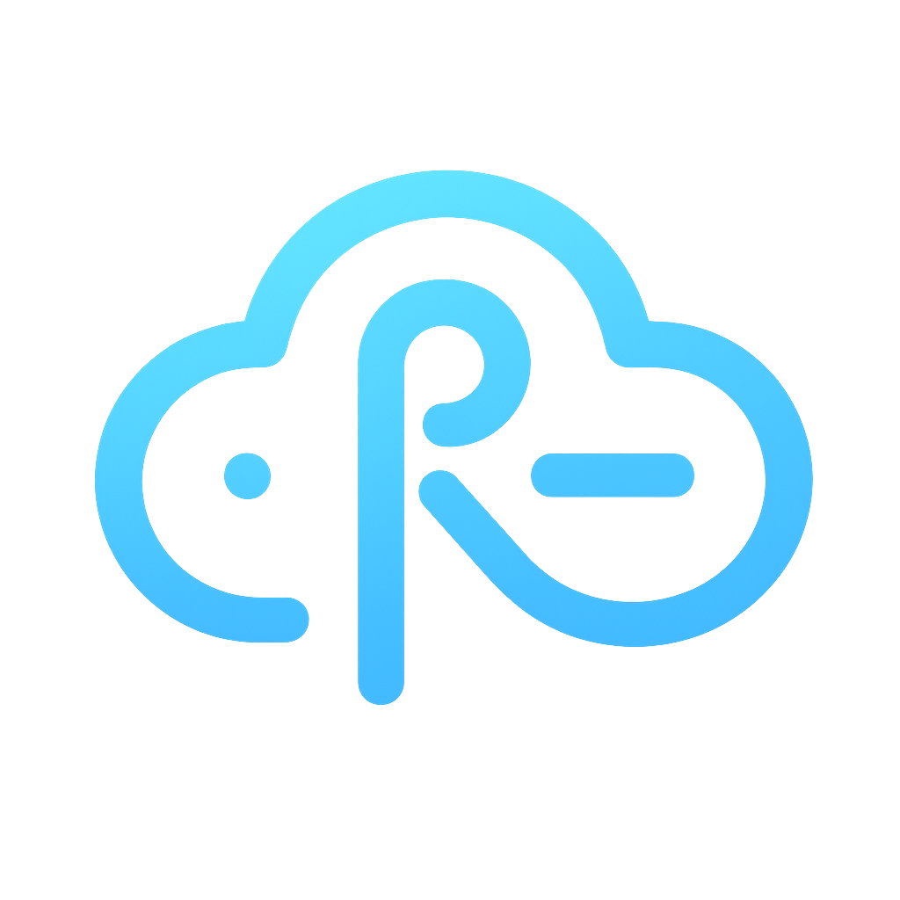

<p align="center">
  
</p>

# Ryvie Desktop

Application Electron pour lancer Ryvie avec détection automatique de la disponibilité locale/publique.

## Fonctionnalités

- **Détection automatique**: teste l'API locale `http://ryvie.local:3002/api/settings/ryvie-domains`.
- **Basculement**: si la connexion locale échoue, bascule vers l'URL publique fournie par l'API.
- **Gestion des changements d'ID**: avertit si un nouveau serveur local est détecté.
- **Stockage persistant**: sauvegarde la configuration utilisateur.

## Prérequis

- Node.js 18+ recommandé
- Windows, macOS ou Linux (builds configurés pour les 3 plateformes)

## Installation

```bash
npm install
```

## Développement

```bash
npm start
```

## Build & scripts

| Commande | Description |
|----------|-------------|
| `npm start` | Lance l'application en mode développement. |
| `npm run icons:win` | Génère l'icône Windows (`.ico`) à partir du SVG avec fond blanc arrondi. |
| `npm run icons:mac` | Génère les icônes macOS (`.icns` et PNG pour Linux). |
| `npm run icons:all` | Génère toutes les icônes (Windows + macOS/Linux). |
| `npm run build:win` | Build Windows (génère `.exe`). |
| `npm run build:mac` | Build macOS (génère `.dmg` et `.zip`). |
| `npm run build:linux` | Build Linux (génère `.AppImage` et `.deb`). |
| `npm run build:all` | Build pour toutes les plateformes (nécessite l'OS correspondant). |
| `npm run publish` | Publie les builds sur GitHub Releases. |

Les installeurs sont produits dans `dist/`.

### Builds locaux par plateforme

- **Windows** : `npm run build:win` (produit `.exe`)
- **macOS** : `npm run build:mac` (produit `.dmg` et `.zip`)
- **Linux** : `npm run build:linux` (produit `.AppImage` et `.deb`)

> ⚠️ **Important** : Vous ne pouvez builder que pour votre OS actuel en local.
> Pour builder pour toutes les plateformes, utilisez GitHub Actions (voir ci-dessous).

## Utilisation

1. Au démarrage, l'app affiche un splash, puis l'écran principal.
2. L'app teste l'API locale `http://ryvie.local:3002`.
3. Le bouton « Ouvrir Ryvie » ouvre:
   - **En local**: `http://ryvie.local:3000` dans le navigateur par défaut.
   - **Sinon**: l'URL publique renvoyée par l'API (ex: `https://app-xxxxx.ryvie.fr`).
4. Si un nouvel ID Ryvie local est détecté, une confirmation est demandée.

## Plein écran pour Ryvie Web

- **Dans le navigateur externe**: on ne peut pas forcer le plein écran depuis l'app (l'utilisateur peut activer F11 manuellement).
- **Intégré dans Electron (optionnel)**: charger Ryvie Web dans une fenêtre Electron en plein écran.

Étapes (option de base):

1) Dans `src/main/main.js`, dans `createMain`, remplacer le chargement de l'interface par l'URL:

```js
// Remplace:
// mainWindow.loadFile(path.join(__dirname, '../renderer/index.html'))
// Par:
mainWindow.loadURL('http://ryvie.local:3000');
```

2) Activer le plein écran pour cette fenêtre:

```js
// Option A: à la création de la fenêtre
mainWindow = new BrowserWindow({
  fullscreen: true,
  // ...le reste de la config
});

// Option B: après ready-to-show
mainWindow.once('ready-to-show', () => {
  mainWindow.setFullScreen(true);
  mainWindow.show();
});

// Option C (kiosque): empêche de sortir facilement
// mainWindow = new BrowserWindow({ kiosk: true, ... })
```

Raccourcis utiles: `F11` (plein écran), `Esc` (sortie du plein écran, si kiosque désactivé).

## Configuration

- Fichier de config: `%AppData%/Ryvie Desktop/ryvie-config.json`
- Icône app/raccourci: `build/icons/win/icon.ico`
- URLs par défaut:
  - API locale: `http://ryvie.local:3002/api/settings/ryvie-domains`
  - App locale: `http://ryvie.local:3000`

## Icônes multi-plateformes (coins arrondis)

- **Source** : `ryvielogo0.svg`
- **Style** : Fond blanc avec coins arrondis façon iOS

### Windows
- Script : `npm run icons:win`
- Tailles : 16, 24, 32, 48, 64, 128, 256 px
- Sortie : `build/icons/win/icon.ico`

### macOS
- Script : `npm run icons:mac`
- Tailles : 16@1x/2x, 32@1x/2x, 128@1x/2x, 256@1x/2x, 512@1x/2x
- Sortie : `build/icons/mac/icon.icns` (+ `.iconset/`)

### Linux
- Généré automatiquement avec `npm run icons:mac`
- Tailles PNG : 16, 32, 64, 128, 256, 512, 1024 px
- Sortie : `build/icons/mac/png/`

> ⚠️ Réexécuter `npm run icons:all` avant chaque build si le SVG évolue.

## Builds automatiques avec GitHub Actions

### Configuration

Un workflow GitHub Actions (`.github/workflows/build.yml`) est configuré pour builder automatiquement sur les 3 plateformes.

**📱 macOS :** L'app est automatiquement **signée et notarisée** avec un certificat Developer ID. Voir [MACOS_SIGNING.md](MACOS_SIGNING.md) pour la documentation complète.

### Déclenchement

**Option 1 : Tag de version (recommandé)**
```bash
git tag v0.0.16
git push origin v0.0.16
```
→ Build automatique + création d'une release GitHub avec tous les installeurs.

**Option 2 : Déclenchement manuel**
- Allez dans l'onglet "Actions" de votre repo GitHub
- Sélectionnez "Build & Release"
- Cliquez sur "Run workflow"

### Résultats

Les builds sont automatiquement uploadés sur GitHub Releases :
- **Windows** : `Ryvie-Setup-x.x.x.exe` + fichiers de mise à jour
- **macOS** : `Ryvie-x.x.x.dmg` + `.zip` + fichiers de mise à jour
- **Linux** : `Ryvie-x.x.x.AppImage` + `.deb`

## Mises à jour automatiques (Electron Updater)

1. **Incrémenter `version`** dans `package.json` avant chaque publication.
2. **Créer un tag** :
   ```bash
   git tag v0.0.16
   git push origin v0.0.16
   ```
3. **GitHub Actions** build automatiquement et publie sur GitHub Releases.
4. **L'app** vérifie automatiquement les mises à jour au démarrage.

> **Note** : Les mises à jour automatiques fonctionnent sur Windows et macOS. Sur Linux, l'utilisateur doit télécharger manuellement la nouvelle version.

## Structure du projet

- `src/main/main.js`: Processus principal Electron
- `src/main/preload.js`: Script de préchargement (IPC)
- `src/renderer/index.html`: Interface HTML
- `src/renderer/renderer.js`: Logique UI
- `src/renderer/styles.css`: Styles
- `src/renderer/splash.html`: Splash screen
- `package.json`: Scripts et dépendances

## Technologies

- Electron
- Node.js
- electron-builder

## Dépannage

### macOS : Installation

L'application est **signée et notarisée** avec un certificat Apple Developer ID. Elle s'ouvre sans avertissement de sécurité.

Si vous rencontrez un message de sécurité, consultez [MACOS_SIGNING.md](MACOS_SIGNING.md#dépannage).

### Autres problèmes

- Si `ryvie.local` n'est pas résolu: vérifier DNS local/hosts ou la disponibilité du serveur.
- Si rien ne s'ouvre: lancer depuis un terminal et vérifier la console.
- Pour forcer l'ouverture locale: vérifiez que l'API locale répond avec `success: true` et fournit `domains`.